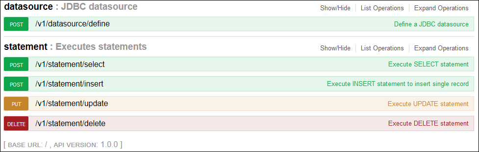

# clj-pg-query

A microservice written in Clojure for talking to PostgreSQL instances.

## Key features

 - A RESTfull microservice;
 - Define a JDBC datasource using POST method;
 - Execute SELECT statement using POST method;
 - Execute INSERT statement using POST method;
 - Execute UPDATE statement using PUT method;
 - Execute DELETE statement using DELETE method;
 - Swagger UI.

## Swagger UI



## How-to

Based on [PleaseFoundation/PG](https://github.com/mikeball/foundation)

### Define a JDBC datasource
> POST /v1/datasource/define
> DatasourceConfig:

```json
{
  "host": "127.0.0.1",
  "port": 5432,
  "database": "postgres",
  "username": "postgres",
  "password": "P@ssw0rd!"
}
```

### Selects - DSL for simple select queries
> POST /v1/statement/select

> Table: pg_amop

> Where:

```json
{
  "amopopr": 522
}
```

### Updates - DSL for updating data
> PUT /v1/statement/update

> Table: pg_amop

> Clause:

```json
{
  "columns": {"amoplefttype": 44,
              "amoppurpose": "j"},
  "where": {"amopfamily": "46"}
}
```

### Inserts - DSL for inserting data
> INSERT /v1/statement/insert

> Table: pg_amop

> Data:

```json
{
  "amopfamily": "46",
  "amoplefttype": "234",
  "amoprighttype": "4565",
  "amopstrategy": "222",
  "amoppurpose": "s",
  "amopopr": "98",
  "amopmethod": "44",
  "amopsortfamily": "99"
}
```

### Deletes - DSL for deleting data
> DELETE /v1/statement/delete

> Table: pg_amop

> Where:

```json
{
  "amoplefttype": 33
}
```

## Prerequisites

You will need [Leiningen][] 2.0.0 or above installed.

[leiningen]: https://github.com/technomancy/leiningen

## Running

To start a web server for the application, run:

    lein ring server

## License
Distributed under the Eclipse Public License either version 1.0 or (at your option) any later version.
